

# KART

### Korean Analysis, Regulation & Trading Intelligence

**외국인 투자자의 한국 증시 투자 전 과정을 지원하는 AI Agent 솔루션**

[서비스 바로가기](https://www.kartkr.cloud/) · [Frontend](https://github.com/2026-finance-ai-challenge/frontend) · [Backend](https://github.com/2026-finance-ai-challenge/backend) · [AI](https://github.com/2026-finance-ai-challenge/AI)

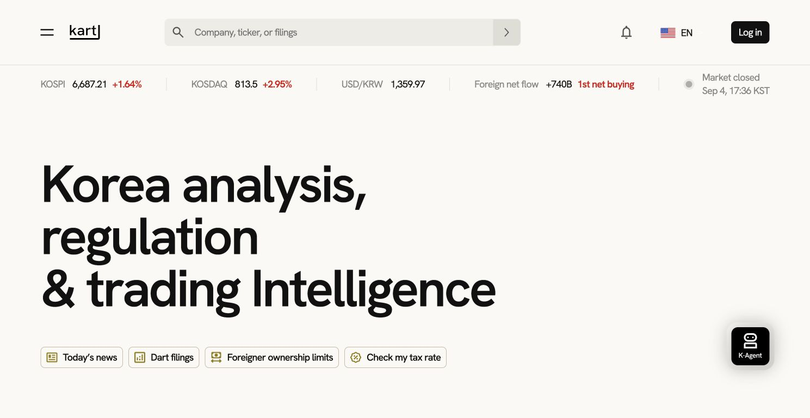

## Why KART?

외국인 투자자 등록제 폐지와 외환시장 개방으로 한국 자본시장의 제도적 진입 장벽은 낮아지고 있지만, 실제 투자 과정에는 여전히 정보 비대칭, 한국 특유의 거래 제도, 복잡한 세무 절차가 남아 있습니다.

KART는 흩어진 시장·뉴스·공시·규제·세무 정보를 하나의 웹 포털에서 연결해 외국인 투자자가 한국 투자자와 동등한 맥락으로 시장을 이해하고 판단하도록 돕습니다.

## Core Values

| 가치 | KART가 제공하는 경험 |
| --- | --- |
| 진입장벽 해소 | 별도 설치 없이 웹에서 한국 시장 정보와 세무 가이드에 접근합니다. |
| 차별 없는 정보 습득 | 단순 번역을 넘어 한국 금융 맥락과 근거를 함께 설명합니다. |
| 투자자 권익 보장 | 거래 제한과 조세조약 적용 조건을 미리 확인하고 필요한 서류를 점검합니다. |

## Key Features

### 1. Korea Market Intelligence

- KOSPI·KOSDAQ 보통주 75개 통합 검색과 KRW·USD 환산 시세
- KOSPI·KOSDAQ·KOSPI 200 지수, OHLCV 및 기간별 차트
- 금융 뉴스의 이벤트·감성·중요도·시장영향 분류와 중복 기사 군집화
- 뉴스·공시 영문 번역 및 **What / Why / Impact** 3축 요약
- 1999년 이후 DART 공시의 구조 보존 원문, 정정 이력, 출처 제공

### 2. Regulation & Trading Intelligence

- VI·단일가·상한가·하한가·거래정지 및 데이터 지연 상태 안내
- 대한항공·한국전력공사·SK텔레콤·LG유플러스의 외국인 보유 한도 모니터링
- 시계열 ML 기반 다음 거래일 또는 장중 외국인 보유율 Min / Base / Max 예측
- 사업·산업·재무 정보를 바탕으로 한 글로벌 상장 피어 매칭

### 3. K-Agent

- General·Stock·News·Filing·Tax Guide 문맥별 근거 기반 대화
- 뉴스에서 선택한 금융 용어와 문장을 현재 기사 문맥 안에서 설명
- 선택한 공시와 문단 범위에 고정된 RAG 질의응답과 원문 인용
- 대화 검색·전환·이름 변경·삭제·중단·재시도 지원

### 4. Global Tax Support

- 거주 국가와 투자자 유형별 국내 기본세율·조세조약 제한세율 비교
- 거주자증명서·아포스티유·제한세율 적용신청서 준비 안내
- PDF·JPEG·PNG 세무서류 OCR과 필수 필드·서명·인장·체크박스 점검
- 세 문서의 성명·납세자번호·거주국 교차검증 및 경정청구 참고 PDF 제공

### 5. Personalization

- 회원가입·로그인·세션 복원과 안전한 계정 관리
- 관심종목, 최근 본 종목·뉴스·공시, 개인화 인텔리전스 피드
- Desktop·Tablet·Mobile 반응형 UI와 키보드·레이블 기반 접근성

## Product Experience

### 한국 증시 뉴스 인텔리전스

<table>
  <tr>
    <td width="50%">
      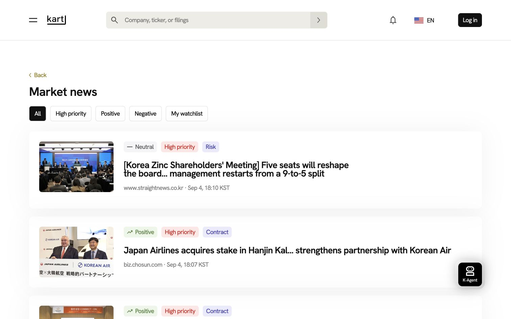
       <b>뉴스 탐색</b> · 감성·중요도·이벤트 필터와 관심종목 기반 피드
    </td>
    <td width="50%">
      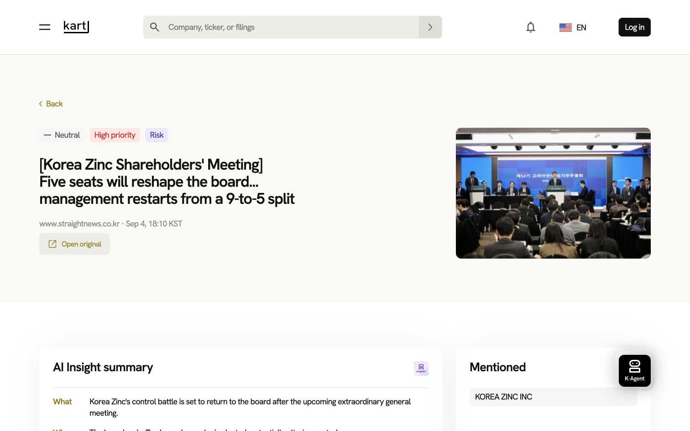
       <b>뉴스 AI Insight</b> · 번역된 본문과 What / Why / Impact 요약
    </td>
  </tr>
</table>

### DART 공시 인텔리전스

<table>
  <tr>
    <td width="50%">
      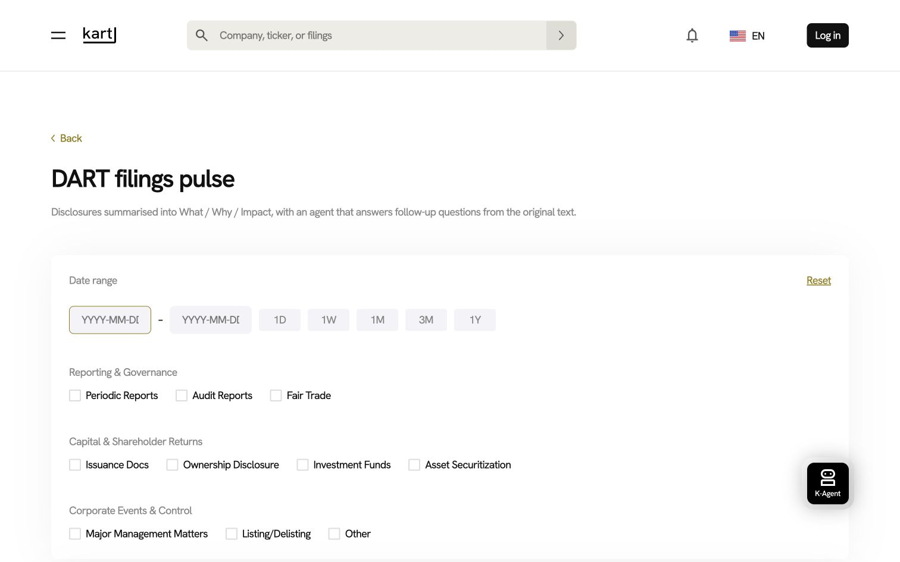
       <b>공시 탐색</b> · 기간·유형·종목·정정 여부를 조합한 검색
    </td>
    <td width="50%">
      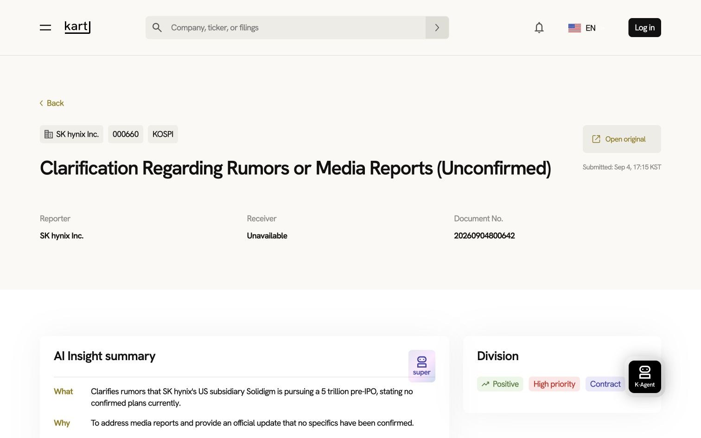
       <b>공시 AI Insight</b> · 구조 보존 번역, 분류 태그, 근거 고정 요약
    </td>
  </tr>
</table>

### 종목·규제 인텔리전스

<table>
  <tr>
    <td width="50%">
      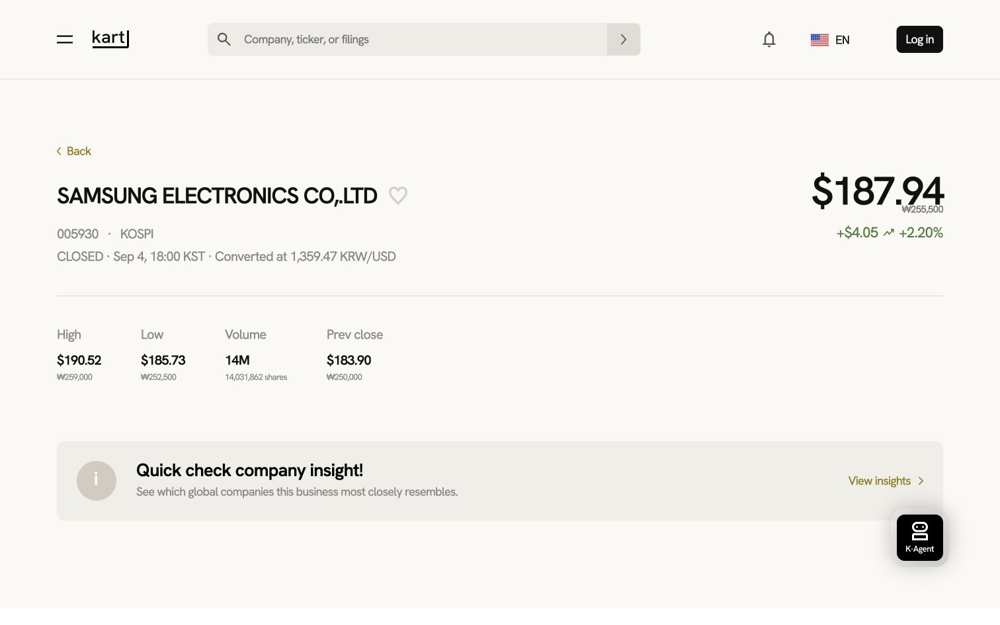
       <b>종목 상세</b> · KRW/USD 시세, OHLCV, 차트와 거래 상태
    </td>
    <td width="50%">
      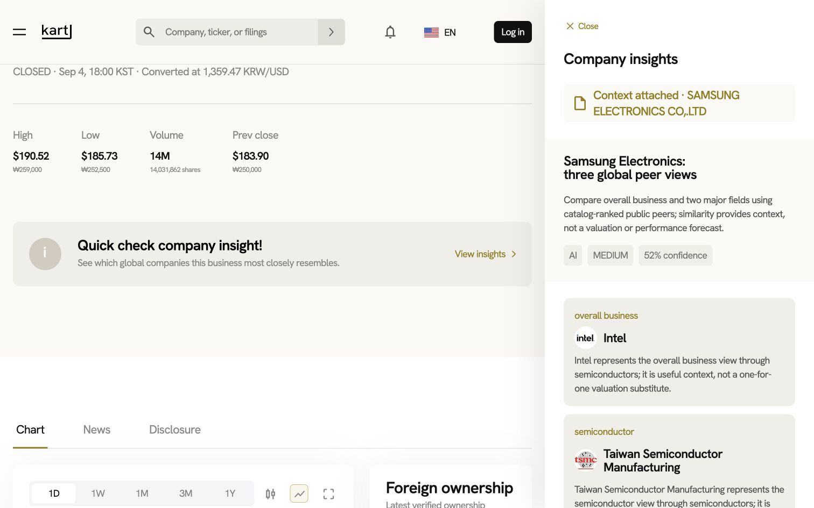
       <b>글로벌 유사기업 매칭</b> · 사업 영역별 대표 피어와 선정 근거
    </td>
  </tr>
</table>

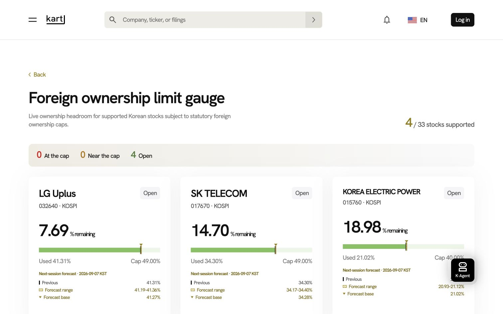

외국인 취득 한도가 적용되는 4개 종목의 현재 보유율·잔여 한도·상태와 다음 거래일 예측 범위를 함께 제공합니다.

### 거래 제한 사전 안내

<table>
  <tr>
    <td width="50%">
      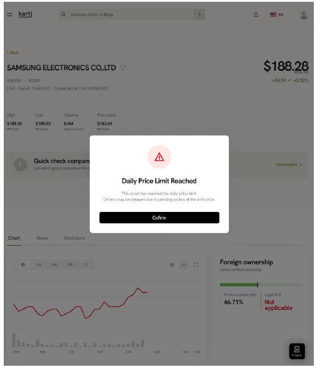
       <b>상·하한가 알림</b> · 주문 지연 가능성을 종목 진입 즉시 안내
    </td>
    <td width="50%">
      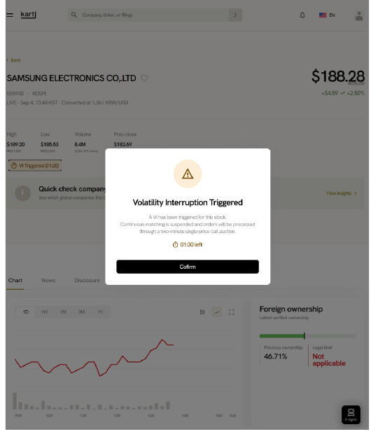
       <b>VI 발동 알림</b> · 단일가 매매와 남은 시간을 명확히 안내
    </td>
  </tr>
</table>

> 상·하한가와 VI 이미지는 해당 거래 상태가 실제로 발생했을 때 표시되는 기능 검증 화면입니다.

### 글로벌 세무 K-Agent

<table>
  <tr>
    <td width="50%">
      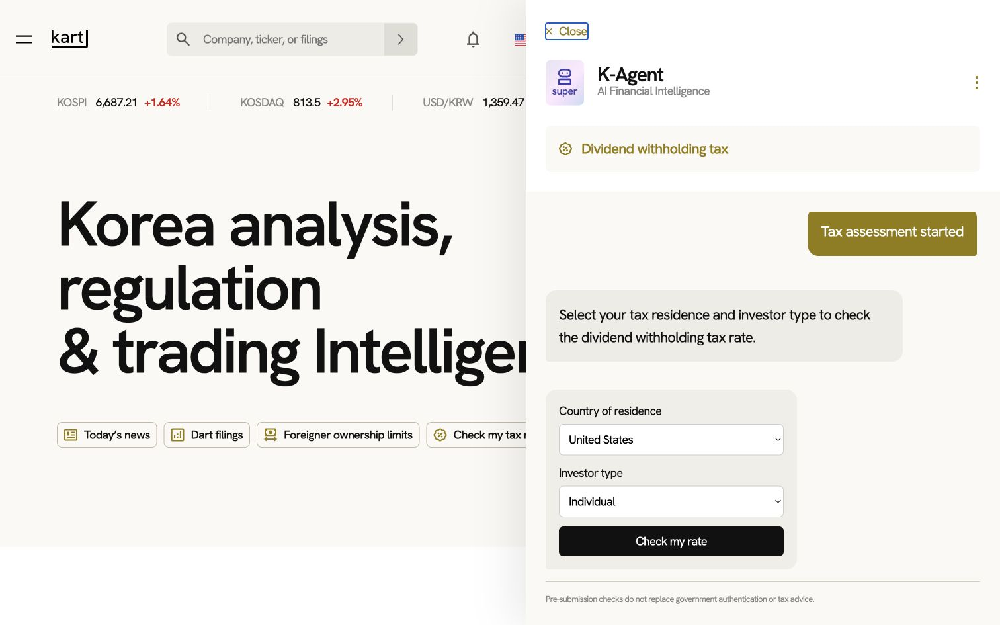
       <b>조세조약 확인</b> · 거주 국가와 개인·법인 유형 선택
    </td>
    <td width="50%">
      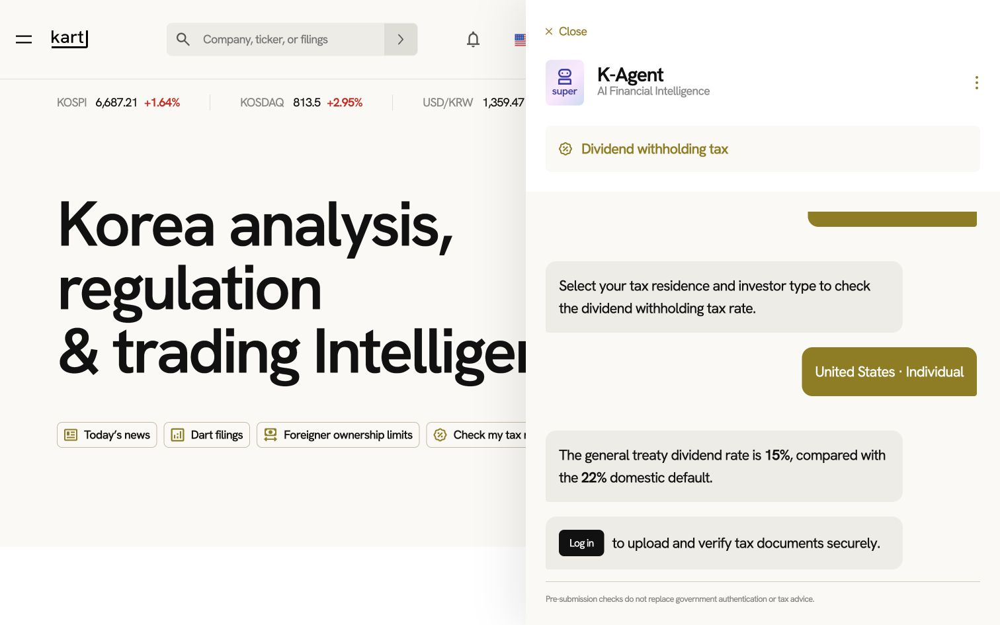
       <b>세율·서류 안내</b> · 국내 기본세율과 조약세율 비교 후 OCR 점검 연결
    </td>
  </tr>
</table>

## How It Works

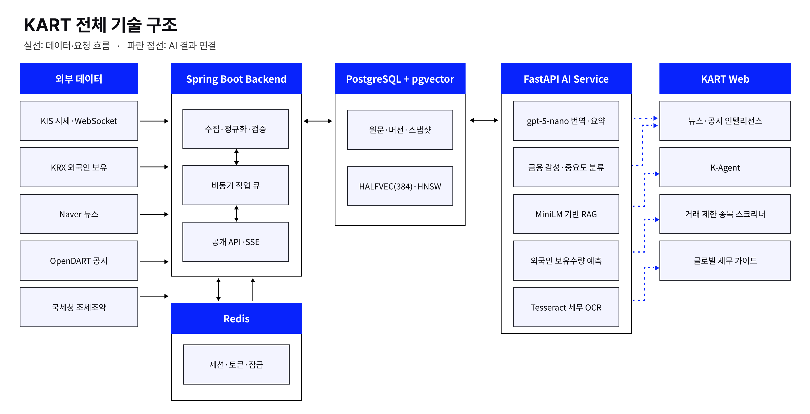

- **Web**은 실제 API 데이터만 표시하며, 데이터가 없거나 지연되면 임의 값을 만들지 않고 상태를 명확히 알립니다.
- **Core API**는 인증·개인화·시장·뉴스·공시·채팅·세무 워크플로와 외부 데이터 수집을 담당합니다.
- **AI Service**는 구조화 번역, 금융 분류, 공시 RAG, 외국인 보유율 예측, 세무 문서 OCR을 독립적으로 처리합니다.
- 원문 데이터와 AI 결과는 분리해 저장하고, 답변과 요약은 검증된 뉴스·공시·공식 세무 근거에 연결합니다.

## AI / ML Evaluation

### 금융 감성·시장영향 분류

뉴스와 공시를 종목·거래일에 연결하고, 금융 감성과 시장영향 중요도를 별도 모델로 분류합니다. 동일한 개발·평가 조건에서 금융 특화 비교 모델과 Macro-F1을 비교했습니다.

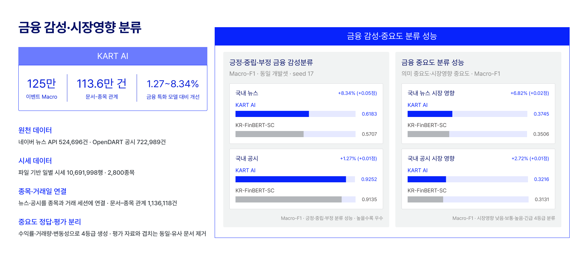

### 외국인 보유수량 예측

29개 종목의 시계열 데이터를 Walk-forward 방식으로 검증했습니다. KART 모델은 21,895개 평가 표본에서 MAE 51,539주, RMSE 147,478주, MAPE 4.4908%를 기록했습니다.

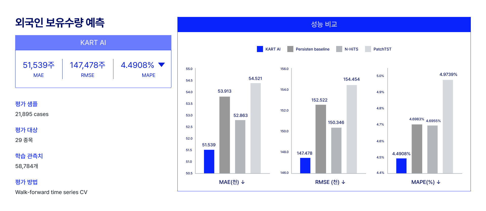

### 세무 문서 OCR·필드 추출

거주자증명서·아포스티유·제한세율 적용신청서 3종의 핵심 필드를 End-to-end로 평가했습니다. 정상 스캔뿐 아니라 기울어짐과 저화질 흐림 조건도 포함해 상용 OCR과 비교했습니다.

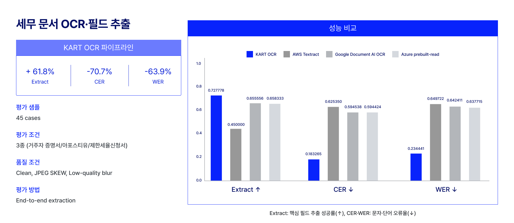

## Tech Stack

| 영역 | 기술 |
| --- | --- |
| Frontend | React 19, TypeScript, Vite, React Router, PDF.js |
| Backend | Java 25, Spring Boot 4, Spring Security, JPA, WebSocket |
| AI / ML | Python 3.14, FastAPI, OpenAI Responses API, Sentence Transformers, scikit-learn, Tesseract |
| Data | PostgreSQL 18, pgvector, Redis 8, Flyway |
| Infrastructure | Docker Compose, Nginx, Vercel |

## Repositories

| 저장소 | 역할 |
| --- | --- |
| [frontend](https://github.com/2026-finance-ai-challenge/frontend) | 반응형 웹 UI, 실시간 데이터 표현, K-Agent 인터페이스 |
| [backend](https://github.com/2026-finance-ai-challenge/backend) | 공개 API, 인증·개인화, 데이터 수집·정규화·영속화 |
| [AI](https://github.com/2026-finance-ai-challenge/AI) | 번역·분류·RAG·예측·OCR 등 AI 워크로드 |

## Team 유니짜장

- 이윤서: 기획, 금융
- 박민정: OCR, 프론트 개발
- 조현덕: UI/UX, 디자인
- 최성현: AI, 백엔드 개발

---

KART가 제공하는 시장·AI·세무 정보는 투자 또는 세무 자문이 아닙니다. 실제 의사결정 전에는 공시 원문, 증권사 및 세무 전문가를 통해 최신 정보를 확인해 주세요.
